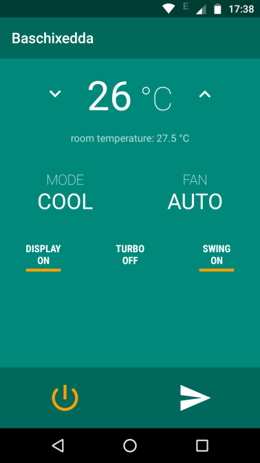

# ESP8266 AC remote control #

#### a little pet project to remote control my Samsung AC unit ####

# Firmware #
## AVR ##
I used an atmega328 with a TSOP1738 IR receiver to reverse engineer
the ARH-901 remote protocol.

The `avr` dir includes the firmware code, nothing too fancy and there
are probably better and broader solutions elsewhere but worked good
enough for me and for this specific remote. You might have to tweak
space mark timings to use it with other remotes.

There's also a reverse engineering session log. I did almost
everything but scheduled on and scheduled off states. Not sure if I
need those, I could probably do something better in the device
firmware.

## ESP8266 ##
The circuit is pretty basic, will include the schematics as soon as I
draw them, *maybe*.

It's mostly an IR led, a couple of current limiting resistors and a
BC547 connected to a GPIO pin.

It also features a DS18B20 temperature sensor in two wire mode.

The firmware is based on https://github.com/pfalcon/esp-open-sdk and
the NONOS SDK from Espressif. It includes:

* a MQTT Client
  * based on https://github.com/tuanpmt/esp_mqtt
  * connects to a local mqtt broker and subscribes to a remote command topic
  * publishes temperature messages

* an IR command parser
  * translates mqtt payloads into a samsung remote state

* an IR driver
  * pulses the IR LED to send the AC state to the unit
  * state machine based bit banging, using hw timers for spaces and
    soft delays for marks
  * queue commands and sends them asynchronously
  * also supports a simpler soft delay based bit banging that locks
    the microcontroller for the whole command, which can last up to
    something like 100ms, this should trigger the watchdog and it's
    not currently used enabled

* a DS18B20 driver
  * reads room temperature

#### some thoughts about the security model ####
MQTT client connects to a *local* mosquitto broker in clear text. I
don't think the scarce resources of a microcontroller should really be
wasted on SSL. That's the broker's job. Local transport is secured by
wifi encryption. The broker talks with the outside world with SSL and
certificate based authentication.

# Android #
There's also a super simple Android app to remote control the device.

It uses Paho MQTT to connect to the broker (using SSL auth) and
publish to the command topic.

